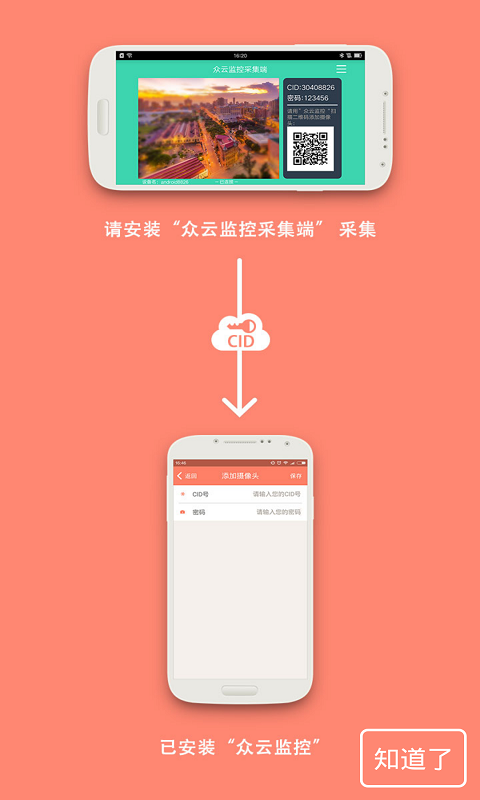
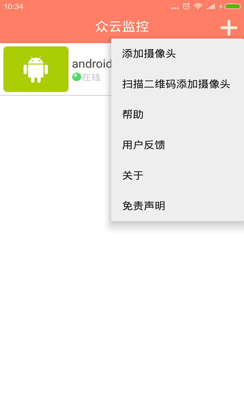
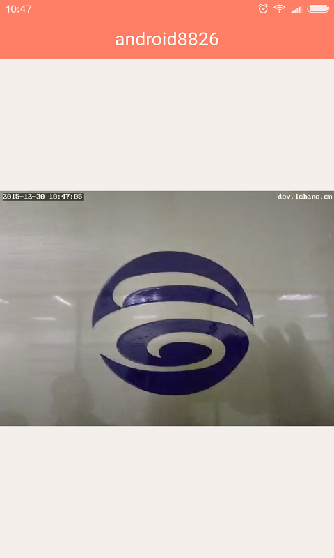

iChano Camera Viewer App
===
  
####This project is the open source for video surveillance app "iChano Camera”,####
####"iChano Camera Viewer" is a lite version of popular app "AtHome Camera".####
####We release the SDK, which we used to develop the app of "AtHome Camera",####
####This app is to demostrate how to use the SDK API. You need register on dev.ichano.com to obtain licenses.####

Developer
------------
* iChano Corp. - <developer@ichano.com>

You also need to download and use video capture app 
-----
* [AVS] [5] iChano Streamer App

This project needs following libs
------------------------------
* [zxing] [1]
* [android-support-v7-appcompat] [2]
* [RoundImageView] [3]
* [QRScanner] [4]

Compiler Requirement
------------------------------
* Android 6.0

Running Android version
------------------------------
* Android 2.3

App Snapshot
-----------

Open Source
-------

  Copyright (C) 2015 iChano incorporation's Open Source Project
 
  Licensed under the Apache License, Version 2.0 (the "License");
  you may not use this file except in compliance with the License.
  You may obtain a copy of the License at
 
       http://www.apache.org/licenses/LICENSE-2.0
 
  Unless required by applicable law or agreed to in writing, software
  distributed under the License is distributed on an "AS IS" BASIS,
  WITHOUT WARRANTIES OR CONDITIONS OF ANY KIND, either express or implied.
  See the License for the specific language governing permissions and
  limitations under the License.

[1]: https://github.com/zxing/zxing/
[2]: https://github.com/OpenIchano/android-support-v7-appcompat
[3]: https://github.com/OpenIchano/RoundImageView
[4]: https://github.com/OpenIchano/QRScanner
[5]: https://github.com/OpenIchano/AVS

